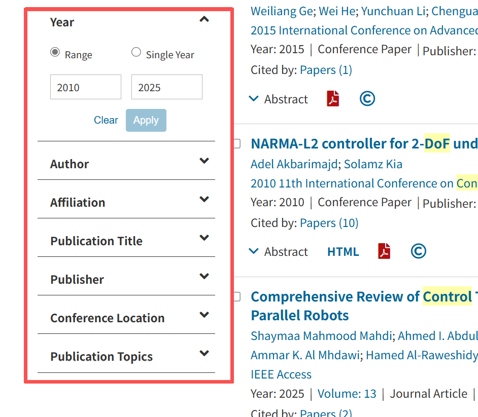
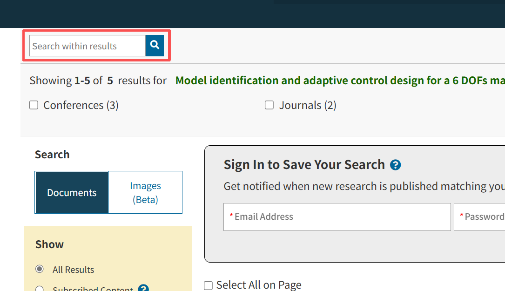

### **1. 🔎 Global Search**

By default, IEEE Xplore searches only the **metadata**. You can limit the search to specific fields using **Boolean expressions**.

**Example:**

```
"Abstract":ofdm AND "Publication Title":communications
```

The platform automatically normalizes British/American spelling, singular/plural forms, and verb tenses, and offers type-ahead keyword suggestions.

**Searchable Fields:**

  * `"Abstract"`
  * `"Publication Title"` (journal or conference title)
  * `"Document Title"` (article title)
  * `"Author"`
  * `"Affiliation"` (author’s institution)
  * `"Standard Number"`
  * `"ISBN"/"ISSN"/"DOI"`

-----

### **2. ⚙️ Advanced Search**

  * **Access:** Click **“Advanced Search”** beneath the main search box.
  * **How to use:**
      * Fill in the three-line template: choose “field – operator – search term”; add more rows as needed.
      * Supports **“AND / OR / NOT”**; parentheses `()` for nesting are **“not”** supported.
      * Use the options at the bottom of the page to limit publication years.

-----

### **3. ⌨️ Command Search**

  * **Access point:** **“Command Search”**, located to the right of Advanced Search.
  * **How to use:** The syntax is identical to the single-box search, but it provides field buttons and respects parenthesis priority, making it ideal for complex strategies.

**Example:**

```
("Abstract":GAN OR "Keyword":adversarial) AND ("Publication Title":medicine OR "Publication Title":biology)
```

This mode supports `NEAR`/`ONEAR` operators, nested parentheses, and has a query length limit of 40 words.

-----

### **4. 🧑‍🔬 Author Search**

This feature lets you quickly locate papers by a specific author.

  * **Access:** Choose **“Authors”** from the drop-down menu on the left side of the top search box.
  * **Points to remember:**
      * The platform searches all fields and is **not case-sensitive**.
      * **Wildcards** are allowed, but at least three letters must be given in either the first or last name (e.g., `M*ke Jone` is valid; `J*y` is not).
      * Citation downloads display the normalized form: surname plus first-name initials.
      * The selected author name appears at the top of the results; a small **“x”** beside it lets you remove that filter.
      * Use the left-hand facet panel to refine the results further.

-----

## 📊 Analyzing Search Results

-----

### **What appears on the results screen?**


Each record shows:

  * **Paper title** (click to expand the abstract)
  * **All authors** (click any name to open the Author Detail page)
  * Author affiliations
  * Publication title, volume, issue, pages
  * Publication or conference date
  * DOI
  * Document-type icon (Journal, Conference, Standard, etc.)
  * Citation counts (separate tallies for papers and patents)
  * Full-text views/downloads
  * **Access indicator:** The 🔓 icon or the label **“Open Access”** signals that the PDF can be downloaded.

-----

### **Sorting the results**

Seven sort options are available:

1.  **Relevance** (default)
2.  Newest First
3.  Oldest First
4.  Most Cited (by Papers)
5.  Most Cited (by Patents)
6.  Most Popular (by download/view volume)
7.  Publication Title A–Z / Z–A

-----

### **Refining the results**


Use the **left-hand facet panel** for:

  * **Search within results** (secondary search)
  * Content Type (journal, conference, standard, etc.)
  * Publication Year (drag the year slider)
  * Author (only names in the current result set)
  * Affiliation (only institutions in the current result set)
  * Topic / Publisher / IEEE Technical Society

Multiple selections can be combined, and counts refresh instantly.

-----

### **Secondary search**


Type a new term in the **“Search within results”** box at the top of the page, or select facets on the left. The query is automatically combined with the previous one using **AND**.

  * For example, after searching for `Java`, entering `XML` in the secondary box is equivalent to searching for `Java AND XML`.